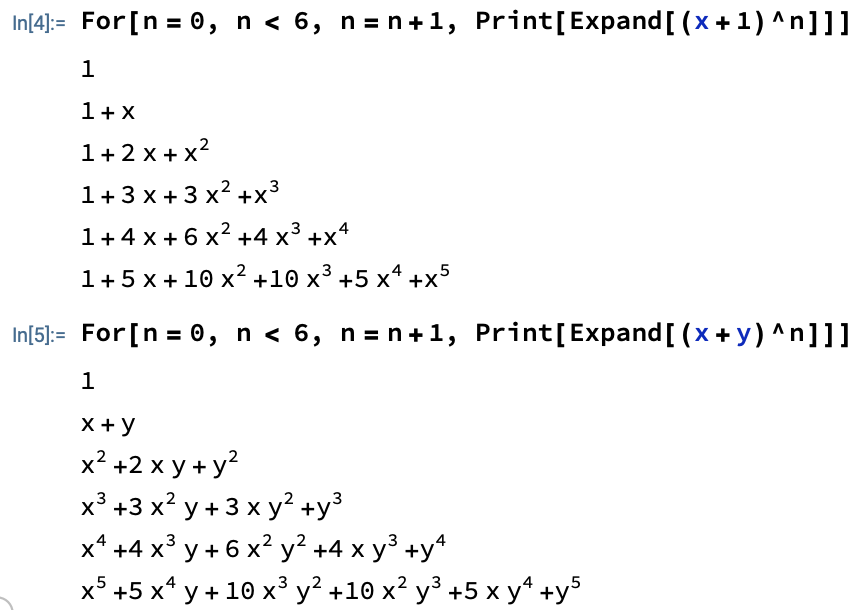

Consider the following question: In the polynomial expansion of $(x+y)^5$, what is the coefficient of the $x^2y^3$ term? You could expand this out as$$(x+y)(x+y)(x+y)(x+y)(x+y)$$

Of course, this would take forever. Is there a better way? [^1]

[^1]: The answer's yes, of course.

Consider the following situation: you have 5 boxes, each with one $x$ and $y$, and you have to choose one element from each box. How many different ways are there to pick out 2 $x$'s and 3 $y$'s? In actuality, this is precisely the same question.

Now consider a simpler case, as we should usually do when something appears difficult. What is the coefficient of the $x^5$ term? Clearly, it is 1. We know that because there's only one way to get $x^5$: pick out an $x$ from each one of the 5 binomials.

Applying this to the $x^2y^3$ example, we know that its coefficient should be the number of ways to pick out 2 $x$'s and 3 $y$'s. How many ways is that? We can pick 2 $x$'s from the first two, and that would automatically fix 3 $y$'s from the last 3 binomials. We could also pick out 2 $x$'s from the last two, and that would also automatically give us 3 of $y$. Does this seem like a familiar concept?

There are $\\binom{5}{2} = \\frac{5!}{2!3!} = \\frac{5(4)}{2}=10$ ways to pick out 2 $x$'s (fixing 3 $y$'s also) from 5 of $(x+y)$. By intuition and the identity $\\binom{n}{k} = \\binom{n}{n-k}$, we know $\\binom{5}{3}$, which can be interpreted as the number of ways to pick out 3 $y$'s and fixing 2 $x$'s, is also 10. [^2]

[^2]: $\\binom{n}{k} = \\frac{n!}{k!(n-k)!} = \\frac{n!}{(n-k)!(n-(n-k))!} = \\binom{n}{n-k}$

The binomial coefficient naturally has the symmetry $\\binom{n}{k}=\\binom{n}{n-k}$, which tells us that if the coefficient of $x^2y^3$ is $\\binom{5}{2}$ (from 5 boxes pick 2 $x$), and the coefficient of $x^3y^2$ is $\\binom{5}{3}$ (from 5 boxes pick 3 $x$), then those two numbers are the same. After all, by inspection, why wouldn't they be? The number of ways to pick out 2 $x$'s from 5 of $(x+y)$ is the same as the number of ways to pick out 2 $y$'s.

This would also imply the coefficient of $xy^4$, $\\binom{5}{1}$, should be the same as the coefficient of $x^4y$, $\\binom{5}{4}$. And, back to where we started, the coefficient of $x^5$, $\\binom{5}{5}$, is the same as the coefficient of $y^5$, $\\binom{5}{0}$.

Knowing now that binomial coefficients $\\binom{n}{0}, \\binom{n}{1}, \\ldots ,\\binom{n}{n}$ are the coefficients of $(x+y)^n$, what if we arrange these binomial coefficients in a triangle like so:



Well, that doesn't look like much. But when we compute the numbers, we get



And hopefully you've seen this before, so you know that each number in the triangle is the sum of the two numbers above it! [^3] To reiterate, note that row $n$ matches the coefficients of $(x+y)^n$. See the following Mathematica code. [^4]

[^3]: If there's no number, pretend it's a 0. And for the top-most 1, that's our base case, have to start somewhere.

[^4]: Here, we can change to $(1+x)^n$ to make it look nicer, but the concept remains the same, as you can see.

Well, there's just one more thing... if we know that the combinatorial and numerical representations of the triangles are the same, then doesn't that necessarily mean that the addition property that holds for the numerical triangle holds for the binomial coefficient triangle as well? [^5] In other words, looking at the middle of the triangle, since $3+3=6$, $\\binom{3}{1}+\\binom{3}{2}=\\binom{4}{2}$? Why?

[^5]: It also means that the base, or first, value(s) have to be the same. Even if you grow in exactly the same way, you need to start at the same point to be exactly the same. This is an example of [mathematical induction](https://en.wikipedia.org/wiki/Mathematical_induction)! For a similar example of induction, see [another post of mine](../eulers_formula#proof-2-by-differential-equation).

First, let's set up the theorem. Let $\\binom{n}{k}$ represent the $k^{\\text{th}}$ entry of the $n^{\\text{th}}$ row of the binomial coefficient form of Pascal's triangle. Since each number in the numerical Pascal's triangle is the sum of the two numbers above, we claim that $\\binom{n}{k}=\\binom{n-1}{k-1}+\\binom{n-1}{k}$. [^6]

[^6]: You should check that this statement does, indeed, refer to an arbitrary entry and the two entries above it. You could confirm using the $\\binom{4}{2}$ example.

## Lemma 1: $\\binom{n}{k}=\\binom{n-1}{k-1}+\\binom{n-1}{k}$

*Proof*. $$ \\begin{aligned} \\binom{n-1}{k-1} + \\binom{n-1}{k} &= \\frac{(n-1)!}{(k-1)!(n-k)!} + \\frac{(n-1)!}{k!(n-k-1)!}\\\\ &= (n-1)!\\left\[\\frac{1}{(k-1)!(n-k)!} + \\frac{1}{k!(n-k-1)!}\\right\]\\\\ &= (n-1)!\\left\[\\frac{k}{k!(n-k)!} + \\frac{n-k}{k!(n-k)!}\\right\]\\\\ &= (n-1)!\\left(\\frac{n}{k!(n-k)!}\\right)\\\\ &= \\frac{n!}{k!(n-k)!}\\\\ &= \\binom{n}{k} \\end{aligned} $$

You can also head to [Wikipedia](https://en.wikipedia.org/wiki/Pascal%27s_rule#Combinatorial_proof) for a very good combinatorial reasoning (no algebra) proof. I'll prove another cool identity using combinatorial reasoning:

## Lemma 2: $k\\binom{n}{k}=n\\binom{n-1}{k-1}$

*Proof*. Let $n$ be the total number of people, and suppose we want to pick out a group of $k$ people with one special person in the group, perhaps a president. There are two ways for us to accomplish this: (1) select the group first and then within the group, select a president or (2) select a president among all people, then form the rest of the group.

The first way involves first picking out $k$ people from $n$ people. There are then $k$ ways to pick the president from the group of $k$. By the [multiplication rule](https://www.khanacademy.org/math/ap-statistics/probability-ap/probability-multiplication-rule/a/general-multiplication-rule), there are $k\\binom{n}{k}$ ways to do this.

The second way is to first pick out a president to be in the group from all $n$ people, and there are $n$ such possible presidents. Then, from the remaining $n-1$ people, we pick out $k-1$ people (because the president is already included in the group). There are $n\\binom{n-1}{k-1}$ ways to do this.

Hence, by combinatorial reasoning, $k\\binom{n}{k}=n\\binom{n-1}{k-1} \quad \blacksquare$
