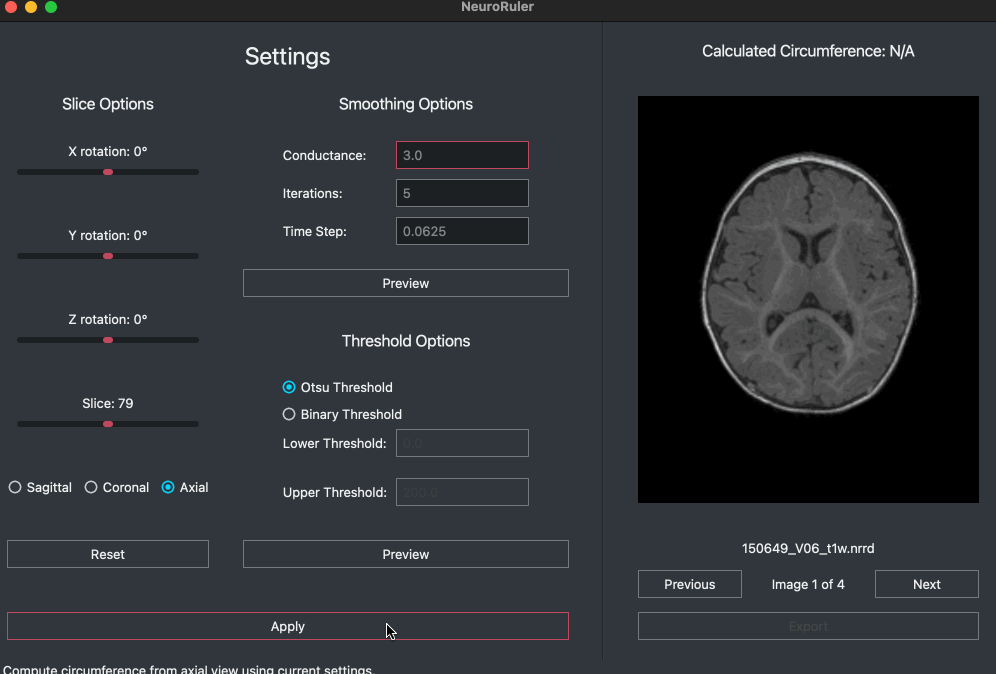

## Links

* [GitHub](https://github.com/NIRALUser/NeuroRuler)
* [Team website](https://tarheels.live/comp523teamd/)
* [Documentation](https://neuroruler.readthedocs.io)
* [Full demo](https://www.youtube.com/watch?v=ZhSg5xwzbmo)

## Description

Cross-platform program that calculates head circumference from MRI data (`.nii`, `.nii.gz`, `.nrrd`). Supports 3D rotations and image smoothing and threshold options. Batch processes data via CLI. Imports and exports circumference and settings data in JSON format.

Installable via `pip install NeuroRuler`. Further instructions available on [GitHub](https://github.com/NIRALUser/NeuroRuler#install).

Made in [COMP 523](https://www.cs.unc.edu/~stotts/COMP523-s23/teams.html) (Software Engineering Lab) in collaboration with Madison Lester, Peifeng "Hank" He, and Eric Schneider for our client, [Professor Martin Styner](https://www.cs.unc.edu/~styner/).

## Figures



```py
{
    "input_image_path": "/Users/jesse/Documents/GitHub/COMP523/NeuroRuler/data/MicroBiome_1month_T1w.nii.gz",
    "output_contoured_slice_path": "/Users/jesse/Documents/GitHub/COMP523/NeuroRuler/output/MicroBiome_1month_T1w/MicroBiome_1month_T1w_contoured.png",
    "circumference": 285.04478394448125,
    "x_rotation": -17,
    "y_rotation": -18,
    "z_rotation": 24,
    "slice": 131,
    "smoothing_conductance": 4.0,
    "smoothing_iterations": 10,
    "smoothing_time_step": 0.08,
    "threshold_filter": "Otsu"
}
```


<p align="center">Example JSON input/output</p>

