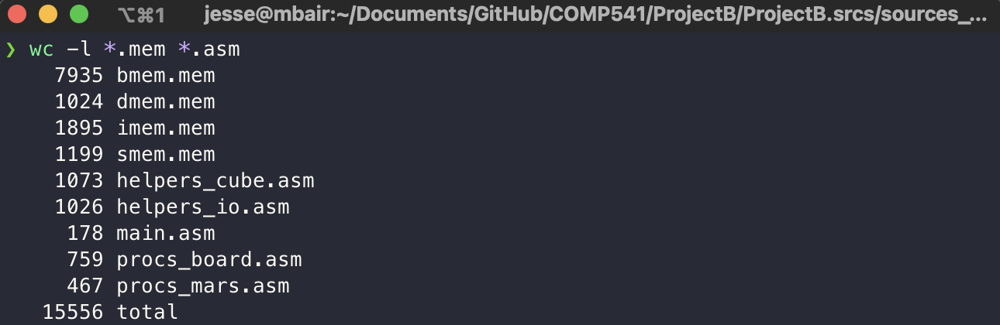
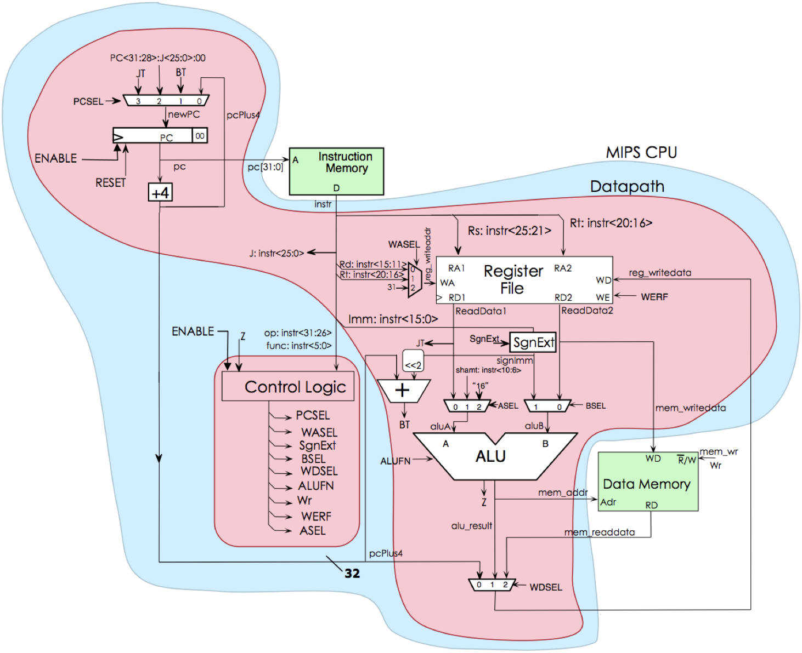



## Description

[1900](#figures) MIPS assembly instructions running on a [SystemVerilog processor](#figures) built from spit and toothpicks in COMP 541 (Digital Logic and Computer Design).

Grade: 100%

Extra credit: $\frac{4}{5}$

## Feedback

> Rubik’s cube simulator:
>
> Wow!
>
> Performs all moves: rotations, slices etc. Undo as well.
>
> Scrambles using PRNG. Generates 8 scrambles. User can modify them but only that last 8 are saved.
>
> Two hardwire modifications: Random number using hardware LFSR. Timer in Verilog on board — LEDs display information.
>
> Nice features: Status bar shows scrambling pattern. Easter egg — sprites change after you solve it. Accelerometer tilt makes rotations. Sound/Jingle on solve win!
>
> All in all, what a truly wonderful project. Initially I thought it would be a pretty tough one to complete, but you successfully did it. In fact, hit it out of the park! Worthy of extra credit (reported separately).
>
> — <cite>Professor Montek Singh</cite>

## Figures



Code line count - <code>imem.mem</code> is instruction memory





MIPS processor implemented in SystemVerilog and deployed on Nexys A7 FPGA board


