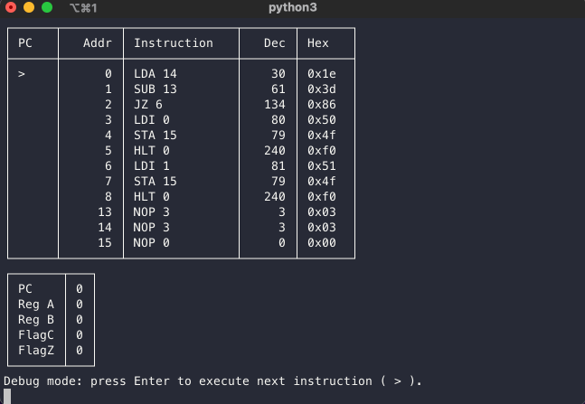
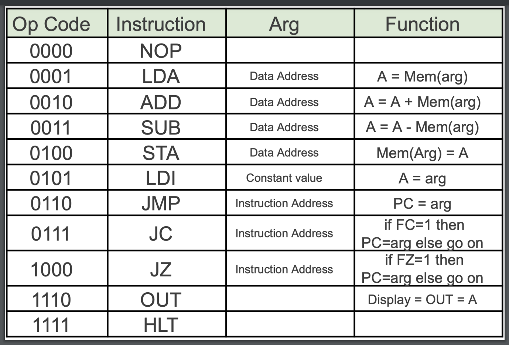
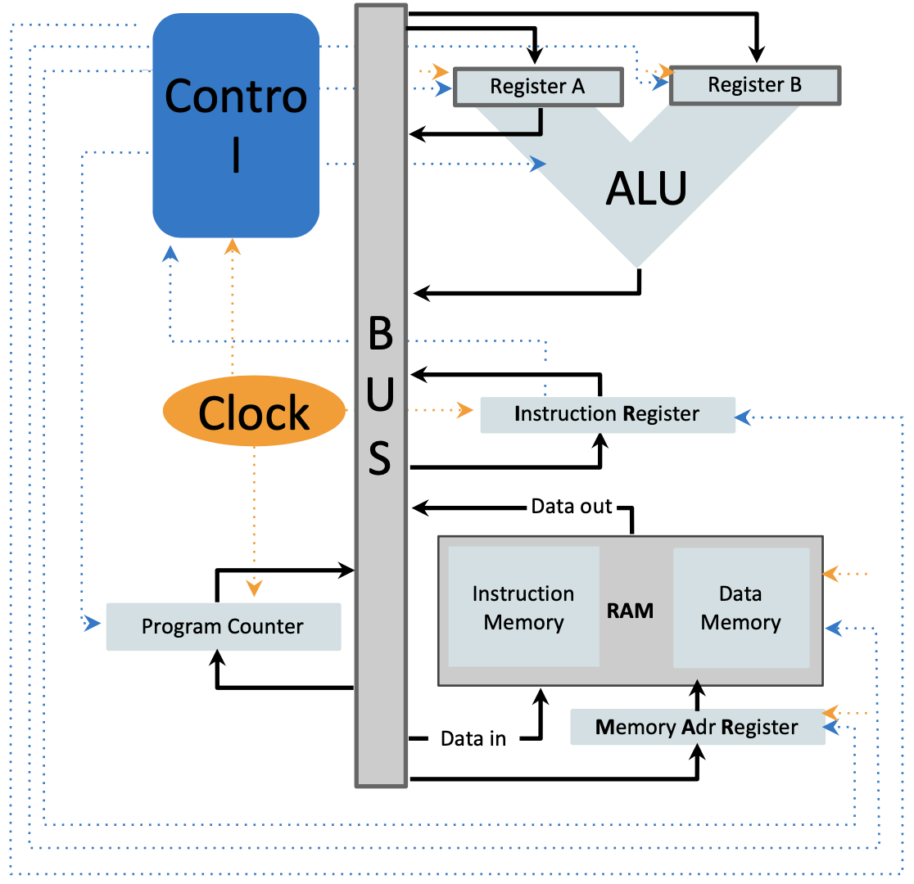

## Links

* [GitHub](https://github.com/jesse-wei/SAPsim)
* [Documentation](https://sapsim.readthedocs.io)

## Description

Simulation of [SAP](#figures) (Simple-As-Possible computer) programs from COMP311 (Computer Organization) @ [UNC](https://unc.edu).

Enabled me to autograde and create COMP311's SAP programming assignment.

Installable via `pip install SAPsim`.

Supports all instructions in the SAP instruction set.

## Figures

[SAP instruction set lecture slides](https://drive.google.com/file/d/1KxM6ov_dZCmehTCQkk0SMgzqG42s7reW/view?usp=share_link)



SAP instruction set





SAP computer


