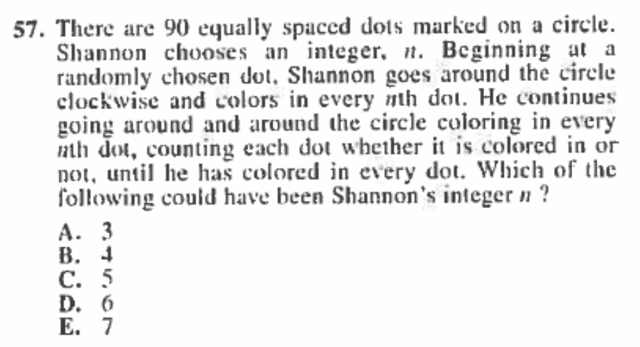

[ACT Guide](https://docs.google.com/document/d/1p9AaWGGZ07w8vFwpbZ-Y0MmDiw9Vn2i_PkcQfsEvq88) (Google Doc)

Currently working on revising the Google Doc and putting it directly on my website. THE REST OF THIS PAGE IS A DRAFT!

## Introduction

I created this document in high school because lots of people had asked me about how I studied for the ACT, so I decided to write down what I know. You might’ve heard of tutors and textbooks that cost a small fortune, but you can study as effectively as possible without spending any money. Using the strategies here, I scored a [36 on the ACT](https://drive.google.com/file/d/1H6aFuEPKvbsZlgWtR2-lMSE_7sr83XcS/view?usp=sharing) on my first try without using any paid resources. I also privately tutored for a while, and you can see my the rest of my website for stuff I’ve written.

The **most important part of this guide** is the [linked official practice tests](#). My #1 piece of advice throughout the years has been to **do only official (previously administered) tests** and not waste your time on crap (third-party) content. If that’s the only thing you take away from this guide, you’ll have gained ~51% of what it has to offer.

## Study plan

This section describes the high-level study plan you should follow. More specific tips are provided later.

### Test format

You should first familiarze yourself with the test format.

Read this Prepscholar article [^prepscholar_format] for a quick breakdown.

[^prepscholar_format]: [Prepscholar - ACT Format: Expert Guide](https://blog.prepscholar.com/act-format-expert-guide)

Since the ACT has such strict time constraints, it's important to know the number of questions per section, time per section, and time per question.

| Section | # Questions | Time |
| :-----: | :---------: | :--: |
|English|75|45 min|
|Math|60|60 min|
|Reading|40|35 min|
|Science|40|35 min|

### Basics

English and Math are **content-oriented**. This means each question is created to cover specific grammar/math topic(s) that you should've learned from school. If you don't understand the topic(s) that an English/Math question is testing, then you have to guess.

Reading and Science are **skill-oriented**. Certainly Reading can't test you on content of specific books, and Science rarely tests actual science topics [^prepscholar_actual_science] (i.e., 1-3 questions out of 40). These sections do not test "topics." Instead, they test you your ability to absorb new content and answer questions about it quickly. Another way to put it: all answers to all Reading and *most* Science questions are in the passages and figures.

[^prepscholar_actual_science]: [Prepscholar - The only actual science you have to know for ACT Science](https://blog.prepscholar.com/the-only-actual-science-you-have-to-know-for-act-science)

### Study strategy

Based on the above, there are fundamental differences between how you should prep for English and Math compared to Reading and Science.

#### English and Math

For English and Math, you have to understand the basic concepts before grinding out practice tests. If there's a basic concept you don't understand, you need to learn it. Doing a bunch of circle problems won't be of much use if you don't understand circle concepts: circumference, area, circle equation, etc.

To figure out which English and Math concepts you don't understand, you should take one or two practice tests. Write down what you missed, and figure out the specific topics you need to learn. If you missed question 3, is it because you didn't understand the topic(s) it was testing? If so, which topic(s)?

I do want to note that it can be hard to figure out which topic is tested. In short, you don't know what you don't know. In that case, Googling the question is often helpful, and if that doesn't work, you should ask someone [^act_discord] [^act_subreddit].

[^act_discord]: [ACT Discord server](https://discordapp.com/invite/E7pTUQG)
[^act_subreddit]: [ACT subreddit](https://reddit.com/r/ACT)

TODO: [resources](#)

Then you should learn these concepts. Resources are provided below, and you should spend most of your time learning from these resources.

Once you've learned all or nearly all of the basic concepts, you should have at least a 30. This is only a heuristic. It's up to you whether you think you have a solid understanding of the basic concepts, and if you already do, then you should move on to the next step.

Once you understand the basic concepts, the rest of the points will come from grinding out practice tests to improve at taking the ACT. That is, your focus should no longer be on learning new content, though if you come across something you don't know (which shouldn't happen often at this stage), you should obviously learn it. Your focus at this point should be your test-taking skills: answering questions faster, not making careless mistakes, etc. If you know the concept but still got the question wrong, then why did that happen, and how can you fix it?

#### Reading and Science

TODO: link [resources](#)

For Reading and Science, you should read about some high-level strategies that work for other people and figure out what you think would work well for you. Resources are provided below. Then practice those strategies by grinding out practice tests. You should also focus on and improve your test-taking skills during this time.

#### The differences

Notice the differences above. For English and Math, if you don't already have a solid understanding of the basic concepts, then you should spend a lot of time learning those concepts before grinding out practice tests.

For Reading and Science, however, it should only take a small amount of time to learn about some high-level strategies. Then you should immediately start grinding out practice tests.

#### Review mistakes

When I say "grinding out practice tests" above, I don't mean that you should just do a practice test and immediately move on to the next one. After doing a practice test, you should review it thoroughly to learn from your mistakes. This is described further in [Advice for practice tests](#advice-for-practice-tests)

## Topics tested

<!-- todo remove actual resources, just the what's tested. also add for the love of act science -->

[todo](#)

|Section|Topics|Resources|
|:-----:|:----:|:-------:|
|English|Mostly grammar rules. There's also more general writing topics, such as transitions, organization, and style.|Prepscholar - What's Actually Tested On ACT English [^prepscholar_english], Grammarly handbook [^grammarly_handbook], The Complete Guide to ACT English [^meltzer_english]|
|Math|Mostly algebra 1-3 with a few precalculus topics|Prepscholar - What's Actually Tested On ACT Math [^prepscholar_math], College Panda's ACT Math [^panda_math], Khan Academy Math [^khan_math]|
|Reading|N/A|N/A|
|Science|Only a bit of actual science content|Prepscholar - The only actual science you have to know for ACT Science [^prepscholar_actual_science]|

[^prepscholar_english]: [Prepscholar - What's Actually Tested on ACT English](https://blog.prepscholar.com/whats-actually-tested-on-act-english)

[^grammarly_handbook]: [Grammarly handbook](https://www.grammarly.com/handbook)
[^meltzer_english]: Erica Meltzer's [The Complete Guide to ACT English](https://www.amazon.com/Complete-Guide-ACT-English-Fourth/dp/1733589546)

[^prepscholar_math]: [Prepscholar - What's Actually Tested on ACT Math](https://blog.prepscholar.com/whats-tested-on-act-math-concepts-subjects-and-skills)
[^panda_math]: [College Panda's ACT Math](https://www.amazon.com/College-Pandas-ACT-Math-Advanced/dp/0989496473)
[^khan_math]: [Khan Academy Math](https://www.khanacademy.org/math)

As mentioned in [Basics](#basics), Reading and Science don't really test specific topics since they're **skill-oriented**, so I mostly omit those rows in the table above. Reading tests your reading comprehension under time pressure, and I consider Science to be Reading part 2, except with data and figures: graphs, charts, tables, etc. It tests reading and data comprehension in the context of scientific passages and figures.

Each Science section does have 1-3 questions that require actual science knowledge that you should have learned from high school science classes. For a review, see the resource in the table above.

## Advice for learning concepts

* If you have questions, you can ask them in the ACT Discord server [^act_discord] or ACT subreddit [^act_subreddit]. There are plenty of smart people there who are willing to help. You might also consider a private tutor.
* If you can tell that you're seriously struggling with some topic, then you should learn that topic from scratch. Choose a good resource(s), and read everything about that topic. Otherwise, if you have a good baseline of knoweldge, you might want to skim to selectively fill in the gaps. In general, be smart about how you study.
* Keep track of your strengths and weaknesses. You should spend more time on your weaknesses than on your strengths, of course.
* How much time you should spend on studying a particular topic should depend on how often it appears on the exam and how well you understand that topic already.

## Advice for practice tests

Once you have a firm grasp on the basic concepts of English and Math and have some solid strategies for Reading and Science, you should start grinding out practice tests. This is to help you learn the patterns in the test so you can subconsciously “game” the test and recognize trends in the mistakes you make.

TODO you can find [links](#) to **official** practice tests below in resources

**Official** means authentic (i.e., previously administered) ACT tests from the ACT company. It is crucial to use only official (not third-party) tests to prepare.

When taking practice tests, you should replicate actual testing conditions. This means that you should set timers during the test and take the whole test at once instead of just taking individual sections. At the start, you can take untimed tests and individual sections to get acclimated, but you should eventually transition to timed full tests.

Reviewing your mistakes is critical to improving. Specifically, for each question you answered incorrectly or struggled with, ask yourself 3 questions:

1. What mistake did I make?
2. Why did I make this mistake?
3. How do I prevent myself from making this mistake again?

You should write down your answers to these 3 questions so that you can find trends in your mistakes. Here's an example from my own notes.

Answer these questions thoroughly. For example, don't simply brush off a careless mistake. Instead, figure out why you made that careless mistake. Did you misread? Were you in a hurry because you were running out of time (maybe spent too long on other questions)? Did you think you were done with the question but forgot a detail?

Figure out why you make that mistake, and then figure out how to prevent it. If you brush it off without trying to figure out why you made that mistake, then you'll probably make the same mistake again.

Sometimes, a careless mistake is truly just unlucky. Regardless, try to find a specific reason for every careless mistake you make.

If you're going for a really high score (34+), then this is especially important because you don't have a lot of room for mistakes.

## Specific tips

The strategies I describe are ones that worked for me and my students. Although I believe they're optimal and would work well for most people, there may be better strategies for you.

### General

* Here's one of the big secrets you should know (and there aren't many): **There are no hard questions**. The definition of a standardized test is a test created based on standards that are the same for everyone in the U.S. For example, the ACT can't test calculus or advanced statistics on the math section because not everyone has access to calculus and advanced statistics courses. The math section is limited to concepts everyone should have learned in high school. As such, there are no hard problems that you are incapable of figuring out as long as you understand the [basic concepts](#basics).
  * One way the ACT can be difficult even though there are no hard questions is that it imposes strict time limits and tests basic knowledge, such as precalculus and below for math, in ways you may not be familiar with. I show an example of this in the [math section below](#).
* Here's another big secret: Every question and correct answer must be **bulletproof*. This means that there must always be one 100% unambiguously correct answer to every question because if there were more than one correct answer or even no correct answer, students would complain to the ACT about their scores, and that’s something that the ACT company can’t have.
  * How can you apply this knowledge? Well, now you know that no matter how much the ACT questions use terms like “most likely” and “best answer,” there is only one correct answer, and all other choices are wrong. If you’re having trouble finding the right answer, look for the hole(s) in the incorrect answers; it’s guaranteed that there are holes in every incorrect answer and no holes in the correct answer.
  * And don’t think like this either: “Well, this answer choice seems alright, but this other answer choice also seems ok.” That’s the wrong way to go about it. One of those is 100% right (assuming that you haven’t eliminated the right answer choice), and the other one is 100% wrong. This is a black-and-white test.
* One last secret: For all sections (yes, even and especially in ACT Math), you need to **read very precisely**. In all sections, there are questions that include words or short phrases that you must consider to answer the question correctly. These important phrases can also be found in the passages. You must learn to read fast enough to meet the strict time constraints but also precisely enough that you don’t glance over important details.
* If you notice that you’re spending too much time on a single question, skip it because all questions are worth the same. I usually work through about 90% of the questions on my first pass and then answer the rest on my second pass.
* Since the ACT has such strict time constraints, which is the most difficult part of the test, in my opinion, you need to save time whenever possible, however possible. Bubbling answers efficiently can actually save more time than you would think - it could save up to 3 minutes, and since you’re allowed only 35 minutes for both ACT Reading and ACT Science, that time is incredibly valuable. Doing a question in the test booklet and then bubbling in the answer immediately afterward wastes a lot of time because it requires that you physically move your hand over to the answer form and mentally switch tasks for every question. I find it much more efficient to complete an entire section and bubble all of my answers for that section in at the end of my first pass. Then, I'll do the unfinished questions during my second pass and bubble those in. Of course, you could end up misbubbling, which would also make you misbubble all succeeding answers as well. I prevent this by mentally telling myself, “1 is A, 2 is B, 3 is C…” I’ve taken 8 practice tests and have misbubbled only once, which is a rate of error that even those who use a safer strategy would have trouble accomplishing.
* Process of elimination is very useful. On most questions, there are one or two blatantly incorrect answers. On hard questions in which you have trouble deciding on the correct answer, eliminate those first.

### English

* If you are not satisfied with your English score, you’re in luck! The general consensus is that ACT English is the easiest section to improve in because it is mostly just grammar rules.
* ACT English is heavily based on grammar rules. Learn all the grammar rules on the ACT, and ingrain them into your memory by applying those grammar rules in your daily life, your writing, and in your English classes. You can also improve your grammar by reading formal books and articles that use proper grammar.
* Conciseness is key. For questions that test conciseness (e.g., questions for which every answer choice is grammatically correct, and the only difference is conciseness), choose the shortest answer choice.
* Avoid redundancy. If the answer choice repeats something that was previously stated, it is incorrect.
* Take context into account. For many questions, the correct answer is decided not only by the sentence the underlined phrase is in, but also the preceding or succeeding sentence.
  * Specifically, For questions about transitions between paragraphs, read the first few lines of the paragraph that the transition is in and the last few lines of the preceding paragraph.
  * For questions involving transitions in or between sentences, figure out the relationship between the two parts on either side of the transition, and choose the answer choice that exemplifies that relationship.
* Make sure you understand the meanings of transition words. You can use Transitional Words and Phrases [^transitions] to learn them.

[^transitions]: [Transitional Words and Phrases](https://writing.wisc.edu/handbook/style/transitions/)

### Math

* Here are some explanations of some advanced concepts: Advanced ACT Math Concepts [^advanced_math]
* I previously mentioned that there are no hard questions on the ACT; it just has questions involving basic concepts that are tested weirdly. For example, see this question:

[^advanced_math]: [Advanced ACT Math Concepts](../math)

I initially thought that this was some weird probability or statistics question that I had no idea how to do. However, notice that if $n$ is a factor of $90$, then the sequence will repeat itself. For example, $n=6$ causes the following circles to be colored: $6, 12, 18, 24, 30, 36, 42, 48, 54, 60, 66, 72, 78, 84, 90, 6, 12, 18 \dots$ Also, $4$ is incorrect because it’s an even number, so only even-numbered circles would be filled in (odd ones would be left out).

Thus, the correct answer is $7$, which will create a sequence that will eventually hit all dots. As such, the question reduces to "Which of the following numbers is not a factor of 90 and is an odd number?" which is easy, but you have to notice one small detail. As such, this is not an unsolvable hard question - just one that has a "trick." This applies to all "hard" question on the ACT.

* For "hard" questions like the previous one (of which there are relatively few), you need only notice one or two small details and then apply basic concept(s). There will never be a question that uses an advanced concept that was never covered in high school.
* If your answer is not an answer choice, that means you did something wrong, so you need to go back and look for the mistake.
* There are lots of math questions in which a single small but important detail in the question completely changes the answer. You should <ins>underline</ins> those small details so that you don't forget about them while you're solving the problem.
* Don’t spend too much time on easy questions (questions 1-39). Most of the time, they really are just that easy, and there is no trick. If you take too long on the easy ones, you won’t have enough time for the hard ones.
* You need to use fast solutions to problems. If you miss a question because you ran out of time, then you could’ve gotten it right if you did the previous questions faster. While reviewing a question you took too long to solve, first try finding a fast solution by yourself. If you can’t, try asking someone. [^act_discord] [^act_subreddit]
* For some questions, it is faster to plug in answer choices instead of solving for the correct answer. Although, the brute force approach is also slower for other questions. You need to develop an intuition for when to do so, which you can accomplish by doing lots of practice problems.
* Similarly, while checking over your work, you can often plug in your answer to verify its correctness.

### Reading

The strategy that works for most people is skimming the passage, reading the questions, and then looking for answers in the passage.

While skimming, you should not read overly carefully. Your main job is to get a high-level understanding of the passage and to create a mental map of the information. On the other hand, you should read very carefully while looking for answers to questions.

#### How to skim

* Some people advise reading the questions before reading the passages. In my experience, this is a terrible strategy. It wastes a lot of time and does not help much with knowing what to look for.
* Similarly, don't over-annotate. It’s okay to write 1-3 words beside some paragraphs to help you remember what they mean, but you simply do not have enough time to write detailed annotations.
* Since time is so limited, you need to be able to read fast.
  * Read as fast as you can without sacrificing too much comprehension.
  * Find out how fast you can read while still understanding the gist of the passage. You should also know the main ideas and roughly where to find specific details. If you happen to remember a lot of specific details, you might've read too in-depth, and you can afford to read faster.
* Make a mental map of the information found in the passage.
  * This means that after reading, you should know roughly where to find certain bits of information.
  * Some questions do not provide citations, such as “In line [x]” or “In paragraph [x],” so you’ll need to know roughly where to find certain bits of information to answer those questions fast.
  * Don’t just hunt through the passage carelessly to look for an answer. Instead, think logically about where the information should be.
* Do not absorb every detail - you simply do not have enough time.
  * You can re-read the important details later if and when there are questions on that information. Most details aren’t tested in the questions, so why waste time absorbing everything?
  * If you don’t understand a specific detail during the initial read-through, don’t waste time re-reading it until you understand it. That detail may not be tested in the questions, so just move on.
* When a question provides a citation, read that part (and maybe a few sentences before and after) very carefully.
* Some of the passages are really dry and boring, but you need to pretend that you are genuinely interested in them. This will improve your concentration and comprehension.

#### How to answer the questions

* While answering questions, on the other hand, you need to read very carefully and precisely.
* Specifically, take in all important information, but don't jump to any of your own conclusions.
  * We're conditioned in English classes to infer and look for deeper meanings. However, inferences and interpretations are subjective, wheras the ACT is an objective test with bulletproof questions and answers. All correct answers are objective and do not require you to dig for deeper meanings.
  * You should **not** use any of your knowledge outside of the text to answer questions. This will make you answer questions incorrectly. All the information that you need to answer the question correctly is in the text, and it requires no interpretation.
* Because all correct answers are objective and bulletproof, they are oftentimes just restatements of what’s already stated in the text.
* Since all correct answers are bulletproof, eliminate any answers with even a single wrong or inaccurate detail.
* It is a viable strategy to do questions with citations (“In paragraph 1,”  “In lines 12-34,” etc.)  first because those questions require that you go back to the passage. If you do them first, then you’ll be rereading parts of the passage, which may help you answer the other questions. This increases efficiency.

### Science

* ACT Science is like Where's Waldo, a game where you search for a single character in a cluttered picture.

* Let's compare this to an official ACT Science passage from the [2015-2016 Preparing for the ACT Test booklet](https://cdn2.hubspot.net/hubfs/360031/ACT-2015-16.pdf).

* As you can see, the passage includes lots of confusing science terms and information. Your job, however, is just to ignore all the distractions and find what the question asks for.
  * Specifically, don't worry about not understanding some of the science terms - the passage provides all the definitions you need.
* The most important part of ACT Science is knowing what to look for. The questions help with this by using terms such as “In Figure 1,” “Based on study 2,” and “According to the passage,” which tell you where to locate your answer.
* Primary locators are what you should look at first and tell you roughly where to look for your answer.

|Primary locators|Explanation|
|:--------------:|:---------:|
|“Figure 1,” “Figure 2,” “Table 1,” “Table 2,” etc.|Look at the figure with the proper label.|
|“Based on the results of study…”|Look at the data given for a particular study.|
|“Based on study…”|Your answer could be in the passage or the data.|
|“According to the information provided...” “According to the passage...” “Based on the passage...”|Your answer is in the passage.|

* Secondary locators tell you exactly what your answer (Waldo) is:

|Secondary locators|Example/Explanation|
|:----------------:|:---------:|
|Units|e.g. m, s, kg, N|
|Scientific terminology|pH, temperature bath, detector - Any science phrase|
|x and y-axes labels|The words to the side of the axes|
|Answer choices|Sometimes, the answer choices can give clues to your answer.|

These tables are from For The Love of ACT Science.

* When doing the questions, you should not go back to the passage without a purpose. Use these locators to determine what your purpose is.
* Let's look at an example of this process. Consider the following question from the passage above:

* Our primary locator is Figure 1, and our secondary locators are the date August 3 (the x-axis label) and Plot 2 (scientific phrase). Now we need to figure out the rest of the problem.
* Figure 1’s y-axis is albedo, which the passage defines as the “proportion of the total incoming solar radiation that is reflected from a surface.”
* According to the graph, Plot 2’s albedo was 0.20 on August 3, which means 20% of solar radiation was reflected.
* Because the question asks, “was NOT reflected,” we can subtract 20% from 100% to get an answer of J. 80%.
* Notice there was no actual science knowledge involved in this process! This will hold for all but 1-3 questions on each Science section.
* Some people like to skip the passages and data and immediately go to the questions. This is much more viable than doing so in the Reading section since Science provides more locators than does Reading, but it's not my personal preference. Personally, I prefer to skim the passage fast to get an idea of what's going on, but use whatever approach works better for you.
* The general consensus is that the conflicting viewpoints passages are the most difficult. You may want to save those for last.

### Writing

* I’m not going to give many tips for this section because 1. colleges don’t care much about writing since you’ll already be writing essays for your application (that doesn’t mean you shouldn’t care about it at all because failing it will definitely be counted against you; my rule of thumb is that you should aim for an 8+ for even the most selective schools), 2. I got only a 9/12, which I don’t consider high enough for me to give tips to others, and 3. someone else who scored an 11/12 already wrote up an excellent guide. [^vb_writing]
* I do want to quickly mention that essay length is highly correlated with score, as shown in a graph from Prepscholar - How does ACT Essay length affect your score. [^prepscholar_writing]

[^vb_writing]: [VB's Guide to the ACT Essay](https://docs.google.com/document/d/1pGgXi-fEEwbJr0Qdp5OzRkSsWnXr0IklTvFRSiZsCpw/edit?usp=sharing)
[^prepscholar_writing]: [Prepscholar - How does ACT essay length affect your score](https://blog.prepscholar.com/how-does-act-essay-length-affect-your-score)

* Lastly, here's the ACT Writing rubric [^writing_rubric].

[^writing_rubric]: [ACT Writing rubric](http://www.act.org/content/dam/act/unsecured/documents/Writing-Test-Scoring-Rubric.pdf)
