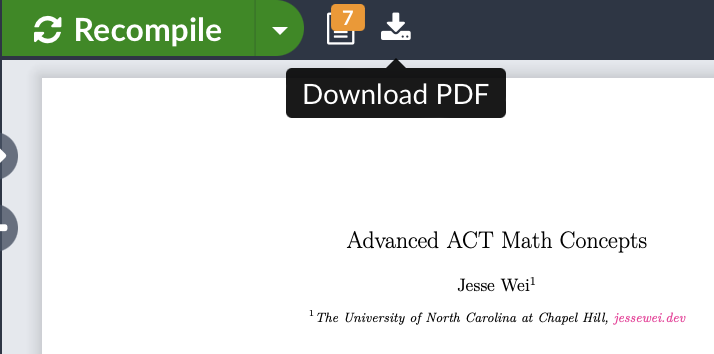

[Advanced_ACT_Math_Concepts.pdf](https://drive.google.com/file/d/1Fq66bmaix6w9pDFY-QEQFMooCSxVTZP5/view?usp=share_link)

For the most up-to-date version, see [Advanced ACT Math Concepts (Overleaf)](https://www.overleaf.com/read/rhmqqyskcrwp).

Click Recompile and the download button at the top right to download the PDF.

