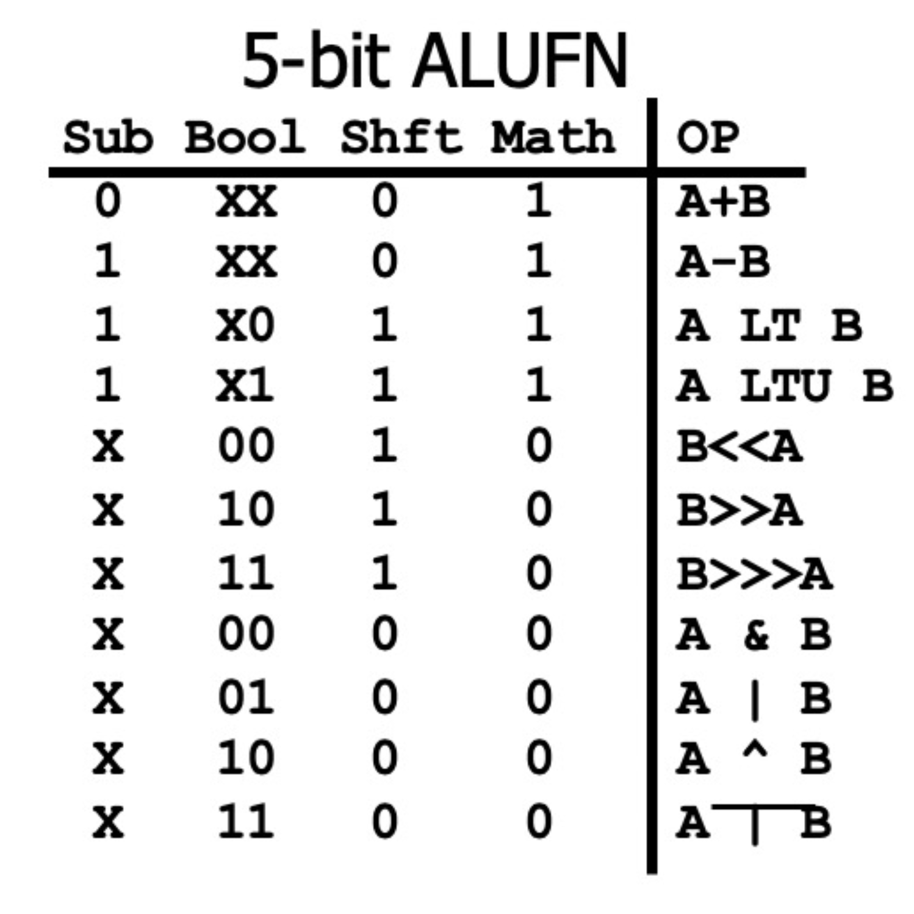

## Course description

A key goal of this course is to demystify the inner workings of a computer. Students will learn

1. How to program computer hardware at a lower level (assembly language)
2. How computer hardware is designed using transistors and logic gates
3. The relationship between hardware and software.

This course will be beneficial both to students who want to pursue further studies in the field of computer architecture and design and to students who simply want a basic understanding of computer hardware so they can write better software.

## My contributions

I was a head UTA for COMP311 in 23S and 22F.

I anticipate being a graduate TA for the course in 23F.

### SAPsim and SAP programming assignment

I developed a SAP (Simple As Possible computer) program simulator, which enabled me to autograde and create COMP311's SAP programming assignment. For more information, see my [SAPsim page](/projects/sapsim).

### Other assignments

I added and wrote the autograder for a new part of Lab 3, in which students build a functional ALU using [Digital](https://github.com/hneemann/Digital), a digital circuit simulator.

I edited the write-ups for all labs and tweaked the autograders when necessary.

### Assessments

I have written 20+ in-use quiz and exam questions. In 23S, I wrote all 5 questions of a brand-new Quiz 7 on the MIPS processor and control signals.

I have reviewed every assessment in the course. I have caught and fixed major mistakes in 10+ questions (mostly before release) and improved 60+ questions.

### Review

I have written and released explanations for 150+ practice PollEverywhere (PEW) questions.

In 23S, I held three 1.5-hour exam review sessions for the entire course. There was an average of 40 students at each review session.

I held office hours and answered student questions on Piazza.

### Circuits

I created the [COMP311 circuits](https://github.com/jesse-wei/COMP311-circuits) resource, which implements and explains 12 circuits from the course. The implementation is done in [Digital](https://github.com/hneemann/Digital).

### Future

I want to create a final project utilizing [MIPS Emulator](/projects/mips_emulator).

I want to add a bit shifter component to Lab 3: ALU. Essentially, I want the ALU to implement the entire 5-bit ALUFN table.



5-bit MIPS ALUFN table


